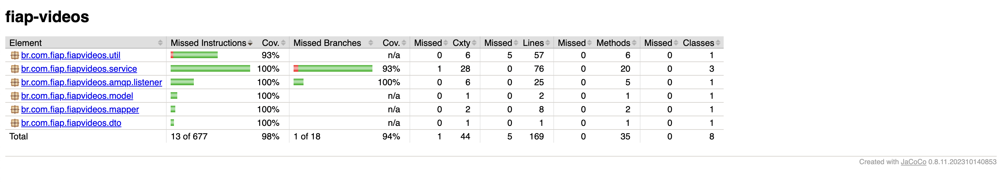

# hackaton-fiap-videos
Descrição
---------
Micro-Serviço de processamento de vídeos da fase 5 do Tech Challenge da pós de Arquitetura de Software da FIAP.

Participantes
-------------
* Bruno do Amor Divino da Paixão - RM360643
* Lucas Matheus Testa - RM360642
* Rodrigo de Lima Amora de Freitas - RM360219

Dependências
------------
O projeto usa o Java 17 e as seguintes dependências:

* Spring Boot 3.4.5
* Spring Security
* Spring Cloud
* Spring Data JPA
* Spring dotenv
* Jakarta Mail
* Lombok
* Devtools
* Micrometer
* Actuator
* RabbitMQ/AMQP
* Swagger
* OpenAPI
* Feign
* RabbitMQ
* jUnit
* Mockito
* MySQL
* Redis
* H2 Database

Documentação da API
-------------------
A documentação da API pode ser vista através do Swagger e do Redoc.<br>

<b>Documentação da API via Swagger:</b>
```shell script
http://localhost:8082/swagger
```

<b>Documentação da API via Redoc:</b>
```shell script
http://localhost:8082/redoc
```

##
Na pasta <b>`Postman`</b> contém a collection para usar os endpoints via Postman.

Banco de dados
--------------
O projeto usa o MySQL como banco da dados para o ambiente local e de produção, o Redis para cache e o H2 para os testes.
<br>
<b>OBS:</b> O script SQL está dentro da pasta `resources` do projeto. 

Configurações projeto:
---------------------
Crie o arquivo <b>`.env`</b> na raiz do projeto e adicione as seguinte variáveis nele:<br>
MAIL_HOST=SMTP do seu e-mail <br>
MAIL_PORT=587 <br>
MAIL_USERNAME=Seu e-mail <br>
MAIL_PASSWORD=Senha do seu e-mail <br>

Gerando o arquivo .jar
----------------------
Para gerar o arquivo <b>.jar</b>, execute o comando na raiz do projeto:
```shell script
mvn clean install -P{profile} -DskipTests
```

Rodando os testes
-----------------
<b>A cobertura de testes do projeto:</b>


##

Para rodar os testes, execute o comando a seguir no terminal na raiz do projeto:
```shell script
mvn test
```

##
Para gerar o relatório de cobertura de testes do projeto com o JaCoCo, execute o comando na raiz do projeto:
```shell script
mvn clean test jacoco:report
```

Rodando o projeto localmente
----------------------------
Para iniciar a aplicação localmente, execute o comando na raiz do projeto:

```shell script
mvn spring-boot:run
```

Rodando o projeto no Docker
---------------------------
Para rodar o projeto em um container Docker, primeiro deve-se gerar o .jar do projeto.<br>
Após isso, deve-se gerar o build das imagens e subir os containers do Docker.<br><br>
<b>Fazendo o build das imagens:</b>
```shell script
docker-compose build
```

<b>Subindo os containers do Docker:</b>
```shell script
docker-compose up -d
```

##
Para automatizar esse processo, basta executar o Shellscript <b>`docker_build_and_run`</b>:<br>
Linux/MacOS:
```shell script
./docker_build_and_run.sh
```

Windows:
```shell script
./docker_build_and_run.bat
```

RabbitMQ
--------
Acesse o RabbitMQ através do endereço:
```shell script
http://localhost:15672/
```

<b>Usuário:</b> Guest <br>
<b>Senha:</b> Guest

##
Para habilitar os pluginsRabbitMQ Shovel e RabbitMQ Shovel Management, execute o comando:
```shell script
rabbitmq-plugins enable rabbitmq_shovel rabbitmq_shovel_management
```

##
Caso queria rodar o projeto loclamente e rodar o RabbitMQ via Docker, execeto o comando:
```shell script
docker run -it --rm --name rabbitmq -p 5672:5672 -p 15672:15672 rabbitmq:3.10-management
```

Monitoramento
-------------
Monitoramento e verificação do comportamento e saúde da aplicação.

### Health Check
Para verificar a saúde da aplicação e os recursos utilizados:
```shell script
http://localhost:8082/health
```

##

### Prometheus
Monitoramento de métricas em tempo real com o Prometheus:
```shell script
http://localhost:9090/
```

##
Caso queria rodar o projeto loclamente e rodar o Prometheus via Docker, execute o comando:
```shell script
docker run --name prometheus -d -p 127.0.0.1:9090:9090 prom/prometheus
```

##

### Grafana
Visualização e análise de métricas através de dashboards com o Grafana:
```shell script
http://localhost:3000/
```

<b>Username:</b> admin <br>
<b>Password:</b> admin

##
Caso queria rodar o projeto loclamente e rodar o Grafana via Docker, execute o comando:
```shell script
docker run -d --name=grafana -p 3000:3000 grafana/grafana
```
